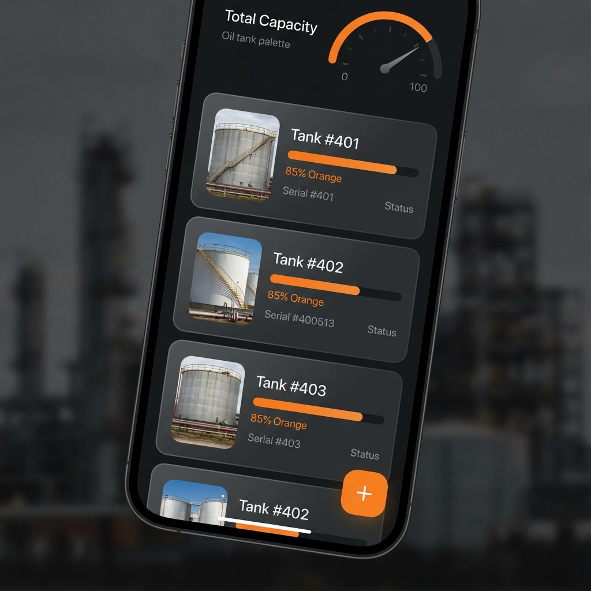
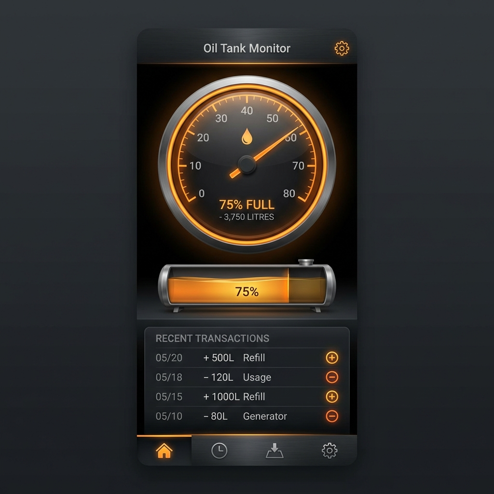

# 🛢️ Oil Tank Manager

A professional, high-performance Flutter application designed for industrial workshops and CNC centers to efficiently track oil consumption, manage barrel inventory, and monitor fluid levels in real-time.

---

## 📖 Project Overview

**Oil Tank Manager** provides a specialized solution for managing industrial oil barrels. In environments like CNC workshops, tracking oil usage is critical for operational efficiency. This app replaces manual logging with a digital, intuitive interface that offers precise tracking of inflows and outflows, historical logging, and visual level indicators.

The application features a "Special Edition" premium UI, focusing on readability in workshop environments through high-contrast dark themes and fluid animations.

---

## 📸 Screenshots & Demo

<p align="center">
  
  
  
</p>

---

## ✨ Features

- **Multi-Barrel Management**: Track multiple oil containers simultaneously with custom names and usage types (e.g., Hydraulic Oil, Coolant).
- **Real-time Oil Gauge**: Dynamic visual representation of oil levels using custom-painted gauges.
- **Transaction History**: Comprehensive logs for every addition and withdrawal, including timestamps, operator names, and notes.
- **PIN Protection**: Secure access to the application with a customizable PIN code to prevent unauthorized logging.
- **Smart Notifications**: Visual warnings when oil levels drop below critical thresholds.
- **Premium UX**: 
  - Smooth Splash Screen transitions.
  - Haptic feedback and auditory cues for successful transactions.
  - Modern "Glassmorphism" UI elements and glowing specialized buttons.
- **Local Persistence**: Full offline capability using Hive for high-speed local data storage.

---

## 🚀 Tech Stack

- **Framework**: [Flutter](https://flutter.dev/) (v3.10.3+)
- **Language**: [Dart](https://dart.dev/)
- **State Management**: Provider (ChangeNotifier)
- **Local Database**: [Hive](https://pub.dev/packages/hive) (NOSQL high-performance storage)
- **Persistence**: [SharedPreferences](https://pub.dev/packages/shared_preferences) for app settings.
- **Typography**: [Google Fonts](https://fonts.google.com/specimen/Cairo) (Cairo - optimized for Arabic/English readability)
- **Audio**: [AudioPlayers](https://pub.dev/packages/audioplayers) for interactive feedback.

---

## 🏗️ Architecture & Design

The project follows the **Clean MVC** (Model-View-Controller) pattern to ensure scalability and maintainability:

- **Models**: Immutable data structures for `Barrel` and `Transaction` with TypeAdapters for Hive.
- **Controllers**: Centralized business logic (OilTankController) handling calculations and state updates.
- **Services**: Abstracted logic for Audio and Local Storage.
- **Widgets**: Atomic design principles with reusable, specialized UI components (Gauges, Cards, Dialogs).

---

## 📂 Folder Structure

```text
lib/
├── controllers/    # Business logic and state management
├── core/           # App constants and theme definitions
├── models/         # Data structures and Hive adapters
├── screens/        # Main application pages (UI)
├── services/       # External service integrations (Storage, Audio)
├── widgets/        # Reusable UI components
└── main.dart       # App entry point & configuration
```

---

## 🛠️ Installation & Setup

### Prerequisites
- Flutter SDK installed on your machine.
- An IDE (VS Code or Android Studio).
- A physical device or emulator.

### Steps
1. **Clone the repository**:
   ```bash
   git clone https://github.com/muhamedxzidan/oil_tank.git
   ```
2. **Navigate to project directory**:
   ```bash
   cd oil_tank
   ```
3. **Install dependencies**:
   ```bash
   flutter pub get
   ```
4. **Generate Hive Adapters**:
   ```bash
   flutter pub run build_runner build --delete-conflicting-outputs
   ```

---

## 🏃 Running the Project

To run the app in debug mode:
```bash
flutter run
```

*Note: The default PIN code for the application is `2580`.*

---

## 💡 Usage Guide

1. **Launch**: Upon first launch, you'll be greeted with a welcome tutorial.
2. **Access**: Enter the secure PIN to enter the dashboard.
3. **Add Barrels**: Use the '+' button to add your first oil tank, specifying its name and total capacity.
4. **Operations**: Tap on any barrel to:
   - Click **"Add Oil"** when refilling.
   - Click **"Withdraw Oil"** when taking oil for machine use.
5. **Logs**: Scroll down in the barrel details to view the complete history of movements.

---

## 🤝 Contribution

Contributions are welcome! If you'd like to improve the app:
1. Fork the Project.
2. Create your Feature Branch (`git checkout -b feature/AmazingFeature`).
3. Commit your Changes (`git commit -m 'Add some AmazingFeature'`).
4. Push to the Branch (`git push origin feature/AmazingFeature`).
5. Open a Pull Request.

---

## 👤 Author

**Muhamed Zidan**
- GitHub: [@muhamedxzidan](https://github.com/muhamedxzidan)
- Professional Software Engineer specializing in Flutter & Industrial Solutions.

---
*Developed with ❤️ for the Industrial Community.*
